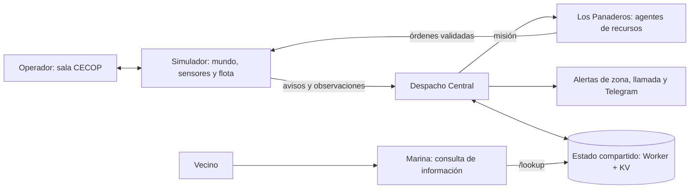

# Los Panaderos

**HackSpain 2026 · Team 9 · Coordinación de emergencias.**

Nuestra propuesta responde al reto [¿Puede la IA gestionar una crisis?](https://hackspain2026.happyrobot.ai/): decidir, actuar y cambiar de plan mientras la situación evoluciona. El alcance de la idea incluye distintas emergencias; el caso implementado y evaluado aquí es un incendio forestal simulado en Brunete.

[Reto y criterios](#el-reto-y-cómo-lo-abordamos) · [Arquitectura](#arquitectura-y-responsabilidades) · [Demo](#demo-en-seis-pasos) · [Arranque](#arrancar) · [Verificación](#verificar-y-presentar-evidencia)

<!--
  Short demo video: simulation (maps, fleet, wind) + HappyRobot in action
  (Despacho, drones, Telegram / llamada). Drop the file and uncomment:

  <video src="docs/demo.mp4" controls width="100%"></video>
-->


## El problema

En un incendio rural el humo llega antes que la confirmación. El viento cambia. Hay más frentes que medios. Hay que decidir ya qué información cuenta, a quién se avisa y dónde va cada recurso. Mandar el camión a un sector es dejar el otro esperando.

El cuello de botella no es solo el fuego. Es la centralita: filtrar avisos, priorizar población y coordinar a la vez la flota y las comunicaciones. Un protocolo fijo se queda atrás en el primer cambio de frente.

## La solución

Un sistema multiagente en HappyRobot. Una centralita, Despacho Central, decide a partir de lo que recibe: aviso de humo, telemetría y reportes del scout. Debajo, agentes heterogéneos ejecutan: scout y dron de extinción (Los Panaderos), camión de bomberos, y canales de aviso (llamada y Telegram).

Drones autónomos vigilan el entorno para detectar pronto. Patrullan y reducen la incertidumbre para orientar la extinción y los avisos. En el simulador cada vehículo tiene autonomía táctica: planificador de ruta, distancia de seguridad al fuego y sistema de extinción. HappyRobot no pilota cada celda.

La prioridad es proteger a la población con los medios disponibles. Una amenaza creíble y viento fuerte hacia un distrito pueden justificar un aviso preventivo antes de confirmar el fuego con sensores; explorar no es un requisito previo a toda evacuación.

## El reto y cómo lo abordamos

### Las seis preguntas

| Pregunta del reto | Respuesta de Los Panaderos | Qué mostrar |
|---|---|---|
| **Qué información importa** | Unir el aviso inicial, observaciones actuales y recordadas de la flota, detecciones de satélite sintético y viento. Distinguir lo confirmado de lo desconocido. | Los dos mapas: realidad del simulador frente a información disponible para los agentes. |
| **Qué va primero** | Priorizar población expuesta, tiempo para avisar y capacidad real de la flota; elegir entre verificar, advertir y contener. | Decisión y motivo, con el distrito amenazado y los medios disponibles. |
| **A quién se avisa y cuándo** | Seleccionar distrito o contacto y canal según el riesgo. Separar informar de ordenar una evacuación. | Destinatario, `action=inform` o `action=evacuate`, y efecto registrado. |
| **Dónde van los recursos** | Repartir tareas entre scouts, drones de extinción y camiones mediante órdenes por ID. | Destino, motivo y estado de cada vehículo; qué recurso queda ocupado. |
| **Qué se hace ahora** | Emitir órdenes ejecutables, validarlas y observar su avance; enviar comunicaciones mediante los flujos correspondientes. | Orden aceptada o rechazada, movimiento y resultado del canal externo. |
| **Cuándo tirar el plan** | Reconsiderar la misión ante viento nuevo, confirmación de fuego, otro foco observado o ruta bloqueada. | Evento nuevo y cambio de objetivo, comparados con la decisión anterior. |

Esto cubre las cuatro capacidades del enunciado: **enterarse de lo que pasa** mediante reportes y sensores; **priorizar** con recursos limitados; **coordinar la respuesta** entre personas y flota; y **adaptarse** cuando cambian las observaciones o las condiciones.

### Requisitos de entrega

| Requisito oficial | Cómo demostrarlo |
|---|---|
| Sistema agéntico — obligatorio | HappyRobot decide misiones y acciones; el simulador no sustituye una respuesta fallida por una estrategia local. |
| Escenario que se mueve — obligatorio | El fuego avanza, el viento cambia y aparecen observaciones o rutas bloqueadas durante la ejecución. |
| Respuesta de varios pasos — obligatorio | Aviso → evaluación → órdenes → ejecución → nueva observación → replanteo. |
| Interacción de verdad — obligatorio | Enseñar una ejecución real de HappyRobot y su intercambio de datos; para acreditar llamada, Web Call o Telegram, comprobar también el resultado en ese canal con un participante de la demo. Una transcripción simulada no prueba una llamada. |
| Interfaz para la persona — obligatorio | La sala CECOP permite entender el estado, inspeccionar órdenes y motivos, pausar, consultar agentes y revisar el historial. |
| Aprende de interacciones pasadas — bonus | Mostrar qué experiencia anterior entra en una nueva decisión y qué cambia gracias a ella. El estado de implementación se detalla en [Aprendizaje](#aprendizaje-y-bonus). |

### Cómo nos evalúan

El enunciado da el mismo peso a los tres bloques:

1. **Decisión, prioridad y adaptación:** actuar con información incompleta, justificar qué va primero y cambiar la respuesta cuando cambia el mundo.
2. **Coordinación y ejecución:** llevar a la vez información, personas y medios, y comprobar acciones fuera del razonamiento del agente.
3. **Supervisión e intervención:** entender qué hace el sistema y poder intervenir. También se valora la creatividad del escenario y su gestión; el aprendizaje de ejecuciones anteriores aporta puntos extra.

El rasgo del proyecto es separar la verdad del mundo de lo que sabe la IA y contrastar sus decisiones con efectos observables en recursos heterogéneos.

## Arquitectura y responsabilidades



- **HappyRobot** decide prioridades, misiones, destinos y comunicaciones. Despacho coordina el incidente; Los Panaderos produce las órdenes de flota mediante Central Command, Scout Agent y Drone Agent. La estructura interna y los nodos dependen de la versión publicada.
- **El simulador** mantiene la verdad del escenario, genera observaciones parciales, valida las órdenes y ejecuta navegación, propagación, extinción y movimiento de población. Las celdas ocultas del fuego no entran en el payload del agente.
- **Worker + KV** intercambia estado público y, en modo `loop`, buzón y órdenes pendientes. **Marina** consulta ese estado; no asigna medios ni introduce la llamada del vecino en el buzón de misiones.
- **La persona** supervisa e interviene desde la interfaz. La aprobación humana obligatoria antes de evacuar es un siguiente paso, no una barrera implementada.

El diagrama expresa responsabilidades. Hay dos transportes de ejecución (`loop` y `push`) y un modo de recursos directo que se explican en [Arrancar](#arrancar).

## 1. Cómo decide la centralita

Brunete no enseña el incendio entero. Hay dos mapas: el terreno y lo que los sensores han visto. El satélite llega tarde. Un foco pintado sigue oculto hasta que un scout o un extinguisher lo observa.

El buzón recibe `farmer_call` (transcripción simulada) y, si el explorador confirma un foco distinto, `scout_fire_report`. Despacho elige avisar, no avisar o verificar, con criticidad y destinatarios. La misión de flota la cierra Los Panaderos: Scout, luego Dron, con una orden por id (`scout-1`, `drone-1`, `engine-1`).

A quién se avisa y cuándo depende del riesgo: viento hacia un distrito sin aviso, tiempo de preaviso y si el fuego está confirmado. No se evacúa Brunete entero. Se avisa el distrito amenazado, o se informa sin mover a la población. El simulador rechaza coordenadas fuera de mapa, distritos inventados o un `reason` vacío.

Si el viento gira o el scout confirma fuego, hay un evento nuevo y la centralita vuelve a decidir.

## 2. Cómo actúa

**Recursos**

| Medio | Papel |
|---|---|
| Dron scout | Patrulla, confirmación temprana, megafonía de aviso |
| Dron extinguisher | Reconocimiento cercano y contención. No vuela a una celda en llamas |
| Camión de bomberos | Ataque al sector (`attack_sector`). Medio principal de extinción |

Un camión en el sector A no está en el B.

**Población y comunicaciones.** Agentes de razonamiento abren el canal: alerta de zona (`evacuate` o `inform`), llamada a un contacto, Telegram personal. Un mensaje de calma no debe salir como evacuación.

La llamada del vecino no pasa por el buzón. Marina pregunta nombre y barrio y lee el estado público (`GET /lookup`).

El operador ve la sala CECOP, puede pausar o cambiar el viento. La relación entre el reloj y la deliberación depende del modo de ejecución.

Más adelante: cruce con bases gubernamentales de residentes en zona, y cámaras térmicas en los drones. Hoy el aviso usa el directorio de demo y sensores simulados.

## 3. Cómo se supervisa

La interfaz muestra misión, órdenes, estado de cada distrito y el registro de comunicaciones. Una orden inválida se rechaza a la vista. El sistema no la sustituye en silencio.

## Aprendizaje y bonus

**Implementado en este checkout:** `mission_context` entrega a HappyRobot las últimas 12 misiones del incidente y sus resultados observados. Permite revisar acciones anteriores durante el mismo incidente; el reinicio borra ese contexto. Es adaptación en contexto, no entrenamiento ni memoria persistente entre incidentes.

**Diseño de aprendizaje que queremos evaluar:** recuperar casos y lecciones en un `episode_brief`, usar mundos posibles para detectar que el plan deja de servir, y escribir una reflexión después del incidente mediante post-mortem. Jev compara decisiones en sombra y nunca aplica órdenes. Todo ello apoya a Despacho y Los Panaderos, que conservan el mando operativo.

El bucle SQLite entre incidentes, `episode_brief`, `forecast_divergence` y la integración local de Jev/post-mortem no están implementados en el código de este checkout. La existencia de un flujo en HappyRobot no demuestra por sí sola que el simulador lo invoque. Para acreditar el bonus falta mostrar una lección guardada, su recuperación en otro incidente y su efecto sobre una decisión.

## Demo en seis pasos

Este es el recorrido completo propuesto. El orden efectivo de las decisiones lo elige HappyRobot; los pasos de recursos pueden solaparse.

| Paso | Interacción y recorrido | Qué comprobar |
|---|---|---|
| **1. La granja avisa** | Aplicar flota y viento, pulsar **Ignición** y **Aviso de humo**. Se genera `farmer_call`, una transcripción simulada. | Despacho recibe el evento y devuelve decisión, justificación, criticidad y destinatarios. En `loop`, debe estar sondeando antes del aviso. |
| **2. Sale el dron extintor** | Despacho solicita una misión a Los Panaderos; vuelve `extinguisher_orders`. | `drone_id`, comando, destino y motivo; aceptación y movimiento. El dron puede empezar explorando, no necesariamente extinguiendo. |
| **3. El scout encuentra otro fuego** | Añadir un foco oculto en el mapa, separado del original, con el scout patrullando. Su detección genera `scout_fire_report`. | El foco no se filtra desde la verdad del simulador; debe observarse antes del reporte. Separarlo más de 12 celdas del aviso inicial y de los focos ya reportados. |
| **4. Un vecino consulta** | Entrar por el flujo de Marina, separado del buzón y de las misiones. El flujo documentado es Web Call; no presupone telefonía entrante PSTN. | Pedir nombre y barrio; leer `identity_status` de `/lookup`. `identified` permite usar la ficha; `unknown_caller` responde por distrito; `ambiguous` o `no_match` requieren aclaración. |
| **5. El camión va al foco** | Los Panaderos devuelve `truck_orders` con `attack_sector`. | Posición válida, motivo no vacío, orden aceptada y estados físicos. Estar en ruta no demuestra contención o extinción. |
| **6. Comunicación por distrito** | Despacho llama al flujo de alerta de zona; llamada y mensaje personal son canales separados. | Enviar siempre `action=inform` o `action=evacuate`, comprobar el destino externo y revisar `communications_sent[].effect`. |

Si falta `action`, el simulador puede inferir evacuación de una criticidad alta; un mensaje tranquilizador con criticidad alta no es equivalente a informar. Revisar la acción explícita antes de la demo. Los efectos registrados incluyen `district_warned`, `district_informed`, `no_change` y `no_recipient`.

Una orden, su emisión, su entrega y su efecto físico son hechos distintos. Los flujos de comunicación documentados pueden registrar `sent` antes de confirmar entrega; el simulador acepta ese estado para ciertos efectos. No presentar ese registro como prueba de recepción humana.

## Arrancar

El servidor usa la biblioteca estándar de Python. Desde la raíz del repositorio:

```sh
python3 -m simulator.server
```

[http://127.0.0.1:8765](http://127.0.0.1:8765) → **Sala de crisis** → flota y viento → **1 · Ignición** → **2 · Aviso de humo**.

La pantalla local puede abrir sin integración configurada. Eso no demuestra decisiones de HappyRobot.

### Elegir el modo y configurar el acceso

Tomar [.env.example](.env.example) como referencia para un `.env` local, sin subir credenciales. No dejar los identificadores de ejemplo o históricos sin comprobar.

| Modo | Configuración | Condición |
|---|---|---|
| Despacho con buzón | `HAPPYROBOT_MODE=loop` — predeterminado; `HAPPYROBOT_TARGET=dispatch`; `STATE_API_URL`, `STATE_API_TOKEN`, `DISPATCH_INCIDENT_ID` | Una versión de Despacho que sondee ese buzón debe estar ejecutándose en development antes del aviso. El simulador no arranca el Run en este modo. |
| Despacho por evento | `HAPPYROBOT_MODE=push`; `HAPPYROBOT_TARGET=dispatch`; proxy MCP autenticado | Requiere una versión que acepte el estado en el trigger. Puede necesitar acceso al Worker desde HappyRobot; no todas las versiones admiten este recorrido. |
| Solo agentes de recursos | `HAPPYROBOT_MODE=push`; `HAPPYROBOT_TARGET=drone`; proxy MCP autenticado | Ejecuta Los Panaderos directamente. No acredita Despacho, Marina, llamadas ni Telegram. Se puede desactivar el Worker local dejando sus variables vacías. |

En `push`, el cliente espera un proxy MCP stdio: por defecto `.cursor/mcp.json`, servidor `happyrobot-mcp-eu-all`, o las rutas/nombre definidos en `HAPPYROBOT_MCP_CONFIG` y `HAPPYROBOT_MCP_SERVER`. La conexión MCP de una herramienta externa no crea automáticamente ese archivo local.

Antes de cada demo:

1. Inspeccionar por MCP la versión publicada para development, sus triggers y los runs activos. Confirmar también la versión del run terminado; un enlace al editor o la última versión borrador no garantiza qué se ejecutó.
2. En `push`, verificar `HAPPYROBOT_WORKFLOW_ID` y los IDs persistentes de los nodos de misión, decisión y comunicaciones mediante las variables `HAPPYROBOT_*_NODE`. No modificar el parser para compensar IDs desactualizados.
3. En `loop`, comprobar autenticación del Worker, que simulador y Despacho comparten incidente/sesión, y que `loop_seen_generation` no adelanta al contador del buzón. Coordinar cualquier limpieza de un incidente compartido.
4. **Reiniciar sí intenta limpiar el estado, eventos y buzón remotos cuando el Worker está configurado.** La operación es asíncrona y puede fallar aunque se reinicie el mapa local: comprobar el estado del puente, no asumir que la KV quedó limpia.
5. Verificar destinatarios de demo. Los teléfonos deben ser dispositivos de participantes; hay un destino Telegram de respaldo en el código, por lo que campos de chat vacíos no garantizan ausencia de envíos. Usar comunicaciones simuladas solo si la versión activa las admite y etiquetarlas como tales.
6. Aplicar flota y viento antes de ignición. En `push`, por defecto el reloj se congela durante la deliberación; en `loop` la simulación y el dispatcher pueden avanzar por separado. Esperar a que termine una decisión antes de pedir otra.

Referencias de edición: [Despacho Central](https://platform.eu.happyrobot.ai/hackspainteam9/workflows/zqtnabjy5loj/editor/wm9viy0rm87v) · [Los Panaderos](https://platform.eu.happyrobot.ai/hackspainteam9/workflows/mg9barxt86w3/editor/ol9kqyjzgq0m) · [Gestor / Marina](https://platform.eu.happyrobot.ai/hackspainteam9/workflows/8angdc9uc7nz/editor/m3cs7r55sfuv). Son versiones concretas, no indicadores de la versión activa.

### Pantallas y límites del escenario

- `/situacion`: panorama nacional. Solo el marcador de Brunete sigue al incidente simulado; otros incidentes, capas meteorológicas y reservas son catálogo de demostración.
- `/incidente`: dos mapas, población, flota, órdenes, controles e historial.
- `/medios`: configuración e inventario. Se permiten 0–3 vehículos de cada tipo, con al menos uno en total.
- `/archivo`: estado compartido y grabaciones. El replay reproduce estados guardados sin volver a llamar a la IA.

El mundo es una cuadrícula educativa de 80×56, con meteorología y satélite sintéticos. No es una predicción operativa ni un feed nacional en tiempo real. Padrón municipal de Brunete: 11.261 habitantes (2025); el reparto por barrios y los 100 ocupantes de la granja son supuestos del escenario. El mapa no está georreferenciado. Véase [procedencia de población](docs/population-provenance.md).

## Verificar y presentar evidencia

```sh
python3 -m unittest discover -s tests -v
node --test tests/test_dashboard.cjs tests/test_pages.cjs
node --test state-api/src/mergeState.test.js
node --check simulator/static/app.js
```

Para cada demostración guardar: commit del simulador, modo, versión realmente ejecutada, run ID, evento de entrada, órdenes aceptadas/rechazadas y resultado físico. En `push`, `.runtime/last-run.json` conserva la última respuesta; las grabaciones y el panel permiten contrastarla con el estado. El movimiento local de un vehículo o el texto del agente, por sí solos, no prueban una decisión ni su resultado.

### Comprobación de recursos en main

En el commit `510eae6a666bae630d1469d8eac10486c360a724` se verificaron cuatro ejecuciones reales de Los Panaderos por MCP, con el simulador sin cambios y un transporte externo autenticado. Versión devuelta por los runs: `01a0bbaf-85ee-7021-85d3-dd4e5b467d09`.

| Evento | Run completado |
|---|---|
| Aviso inicial | `d3b0c348-956e-461b-a769-6811ecce72d1` |
| Observación y replanteo | `b7d4b71e-46e0-4521-9af1-d9de3033a841` |
| Cambio de viento | `4c42f589-6eb7-49e9-bee4-c595224cd1db` |
| Ruta bloqueada y replanteo | `1e0f9431-e36a-4516-9ade-00408aa449b4` |

Se observaron órdenes aceptadas, desplazamiento de recursos y cambios de misión. **No se verificaron en esa captura:** el recorrido completo de Despacho, Marina, teléfono, Telegram, un foco adicional pintado, evacuación completada ni extinción completada.

El intento separado de Despacho (`b8717972-6134-40f7-9e8e-017378d7eb6f`) ejecutó una versión de bucle distinta de la inspeccionada y falló en `Continuar despacho`: `The target workflow has no trigger configured for the selected environment.` Hay que resolver la versión activa y su continuación antes de acreditar la demo integrada.

Las [validaciones históricas](docs/demo-validation.md) documentan otros escenarios y resultados. Son muestras de versiones concretas, no una garantía de que una nueva publicación reproduzca las mismas decisiones.

### Referencias

- [Enunciado y criterios oficiales de HackSpain 2026](https://hackspain2026.happyrobot.ai/).
- [Presentación HTML del repositorio](presentation/los-panaderos-2026-es.html).
- [Prompts de los agentes](docs/mvp-agent-prompts.md).
- [Historial de cambios de HappyRobot](docs/happyrobot-workflow-changes.md): sus afirmaciones de versión LIVE son históricas.
- [Contrato de estado y comunicaciones](workflow/despacho-v15/README.md), [prompt de Marina](workflow/marina-v4/prompt.md) y [Worker de estado](state-api/src/index.js).
