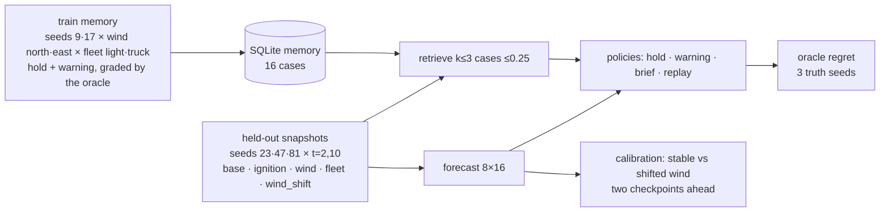

# Adaptation benchmark: what works, what did not, what was fixed

`python3 -m simulator.adaptation_eval --output .runtime/adaptation-eval`
(≈15 min, results in `results.json`). It measures the pieces the agent is
*given* at decision time — the brief, retrieval, the forecast and the
divergence check — with deterministic simulator policies. It says nothing about
what HappyRobot does with that context; that needs a live experiment.

Families (84 snapshots, 336 graded decisions): base; ignition moved next to
`town_north` or `farm`; wind east/south/west/calm/strong north/northeast; fleet
+truck, two drones and no scout, full; and a wind shift applied after the first
decision. Test seeds never enter memory — the run aborts if they do.

## Findings by iteration

| # | Insight from the run | Root cause | Fix |
|---|---|---|---|
| 1 | Under **west** wind every policy scored ≈2440 regret except the oracle: nobody warned `town` | `signature()` initialised district distance at `FAR_CELLS`, so districts farther than 40 cells got downwind = 0 and were never ranked | Compute real distance, cap only the stored value; label schema v2 |
| 2 | Replay tied hold on the **base** family although memory held the identical situation | `experience_agent` skipped regret-0 cases (`not regret`); the warning case, whose plan *was* the best, was ignored | Regret-0 cases are eligible; only ungraded cases are skipped |
| 3 | Replay ignored fleet changes: the closest case under `drones`/`full` fleets was a light-fleet case whose plan named vehicles that do not exist | Signature compared idle counts only; fleet composition was invisible | Fleet term = ½ composition + ½ availability |
| 4 | Even with the right case, the literal plan was invalid on another fleet → hold | Historical vehicle ids and counts are not portable | `episodes.reground`: carry the (command, district) intents on the current fleet's validated options |
| 5 | Wind-shift calibration: **0/42** shifts detected, 0 false alarms | Two checkpoints after a 90° turn the observed footprint had barely moved; geometric drift stayed under the ensemble-scaled threshold | Explicit premise rule: wind turned ≥45° or strength ±1 ⇒ `forecast_divergence`, named "every branch assumed the old wind" |
| 6 | Brief ranked weakly exposed distant districts as "priorities" | Any nonzero cosine counted as exposure | Priority requires forecast threat ≥0.5, downwind ≥0.5 or ≤8 cells; each entry carries its `why` |

## Results (final run)

Mean oracle regret per family (lower is better; 0 = the bounded hindsight
search found nothing better):

| Policy | base | ignition | wind | fleet | wind_shift | all 84 | vs hold (better/tied/worse) |
|---|---|---|---|---|---|---|---|
| hold | 100 | 50 | 2457 | 100 | 25 | 1092 | — |
| warning heuristic | 0 | 0 | 0 | 0 | 0 | 0 | 45 / 39 / 0 |
| **brief** (context handed to the agent) | 0 | 0 | 0 | 0 | 0 | 0 | 45 / 39 / 0 |
| replay (copy or re-ground a past best plan) | 0 | 0 | 2440 | 0 | 0 | 1046 | 39 / 45 / 0 |

Progress across the three runs of the same benchmark:

| Run | brief better than hold | replay better than hold | shifts detected |
|---|---|---|---|
| v1 (labels v1) | 39 | 6 | 0 / 42 |
| v2 (fixes 1–3, 5, 6) | 45 | 27 | 42 / 42 |
| final (fix 4, re-grounding) | 45 | **39** | 42 / 42 |

Replay's remaining 2440 is the six **west**-wind snapshots: the nearest case
sits at distance 0.18–0.20, beyond the 0.15 adoption limit, so replay holds
(memory only saw north and east). In the `drones`/`full` fleets all 12 replay
plans were re-grounded from light/truck-fleet cases and scored 0.

Retrieval offered a case within 0.25 for **every** snapshot in every family
(mean nearest distance 0.01 base … 0.08 wind). Divergence: **42/42** shifted
worlds detected, **0/42** false alarms on stable worlds.

## What this does and does not show

* The deterministic brief reproduces the warning heuristic's decisions on all
  families: the context handed to HappyRobot names the right district first.
* Replay now matches warning wherever memory has seen a comparable wind; under
  a wind memory never saw (west) the nearest case is beyond the adoption distance
  and replay holds. That is the intended behaviour — copying a plan from a
  dissimilar situation is the failure mode we wanted to avoid — and it is why
  memory coverage, not the copy rule, is the lever.
* Regret is against a bounded hindsight search with three truth seeds; 0 means
  "no better plan found", not "no harm".
* None of this measures the language model. Whether HappyRobot's decisions
  improve with the brief remains a live experiment (see
  [happyrobot-experience-contract.md](happyrobot-experience-contract.md)).

Earlier runs are kept beside the final one (`adaptation-eval-v1`, `-v2`) so the
table above can be reproduced from raw rows.
