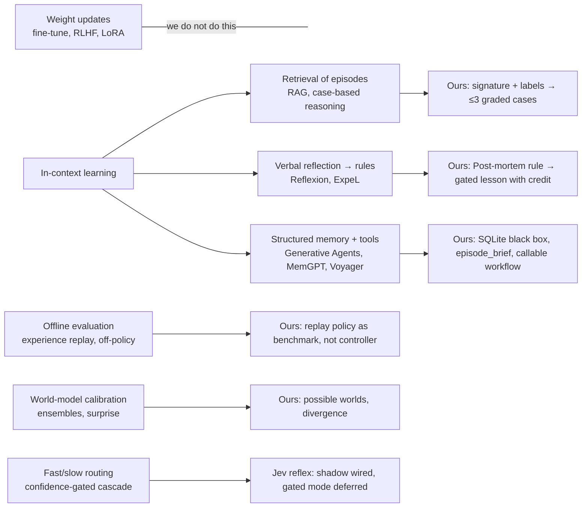

# Continuous learning with frozen LLM agents: notes

Short survey of the methods we considered, what each buys, and what we took. Starting points
only; not a literature review.

## Methods and what we took

| Method | Idea | What it buys | Our use |
|---|---|---|---|
| In-context learning | The frozen model conditions on examples in the prompt | No training, instantly reversible, inspectable | Everything below feeds the prompt, never the weights |
| Retrieval-augmented generation / case-based reasoning | Fetch the most relevant past items by similarity, put them in context | Relevance beats recency; memory scales beyond the window | `experience.retrieve`: weighted signature (phase, wind, fire, districts, fleet), fine-grained labels explain each match, k=3, distance ≤ .25, same-incident excluded |
| Verbal reflection → reusable rules (Reflexion, ExpeL) | After failure, write a short natural-language lesson; reuse it later | Cheap, human-readable improvement | Post-mortem workflow writes root cause + rule; the simulator gates (confidence, recurrence), tracks uses and regret, retires losers |
| Structured episodic memory (Generative Agents, MemGPT) | Store events with metadata; a retrieval step assembles a bounded context | Prevents context bloat, keeps provenance | `episode_brief`: ≤3 cases, ≤5 lessons, 160-char fields, 1200-char text, explicit "evidence, not orders" |
| Tool-mediated retrieval (ReAct/Toolformer style) | The agent (or a step before it) calls a tool for memory | Judgement over which precedents apply | Callable *Experiencia* workflow: reads the brief, judges applicability, returns validated mission fields with provenance; deterministic fallback |
| Skill libraries (Voyager) | Store verified executable procedures | Reuse of proven plans | Oracle-preferred actions are stored per case; replay copies them offline as a benchmark only |
| Experience replay / off-policy evaluation | Re-use stored transitions to evaluate or improve a policy | Sample efficiency; honest offline scores | `evaluation.py`, `adaptation_eval.py`: hold / warning / brief / replay scored by the hindsight oracle on held-out seeds and changed worlds |
| Ensemble world models, surprise-driven replanning | Forecast with an ensemble; act when observation leaves the ensemble | Named reasons to change plan; no alarms on noise | `worlds.forecast` + `surprise`; threshold `min(.30, max(.05, 2×dispersion))` |
| Credit assignment for lessons | Attribute outcome changes to the advice that was active | Removes rules that do not help | `lesson_usage`, ≥3 uses, retire after margin |
| Confidence-gated fast/slow routing | A small fast model answers routine cases, escalates the rest | Latency, cost | Jev shadow (`simulator/reflex.py`): typed choices over validated candidates, high-stakes always escalate, graded by the oracle beside Central |

## Context-engineering rules we follow

1. Bounded: fixed maxima on cases, lessons, characters. Prompt size does not grow with history.
2. Relevant: retrieval by situation distance, not recency; labels say *why* a case matched.
3. Graded: every case carries regret, gap type and the oracle-preferred action; never raw logs.
4. Bounded authority: the brief closes with "evidence, not orders"; current observations, rules
   and constraints prevail; hidden truth is never included.
5. Provenance: every value the agent receives can be traced to a SQLite row and a workflow run.
6. Fail-safe: any retrieval or workflow failure degrades to the deterministic brief, then to
   the plain payload.

## What in-context adaptation cannot do

- It does not change the model; a systematically wrong prior stays wrong until evidence in
  context overrides it every time.
- It only helps if the retrieved case is actually similar. Changed ignition points and fleets
  broke replay in our evaluation; labels and priority ranking are the mitigation, not a fix.
- Gains must be measured against strong simple baselines (hold, warning). A falling regret curve
  on one scenario is not learning.
- Live agent improvement is unproven here: simulator policies are measured, HappyRobot behaviour
  with the brief is not yet.
