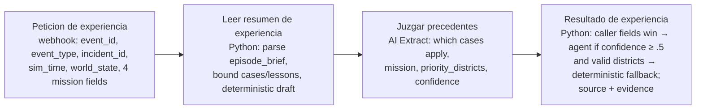

# HappyRobot side of the learning loop

What the simulator now sends, what the agent should do with it, and the one
optional workflow worth building. Nothing here is published; every change to a
workflow is a forked version until a human promotes it.

## Who owns what, and why

| Simulator (repo) | HappyRobot (workspace) |
|---|---|
| Physics, hidden truth, belief world | Judgement: what matters first, who to tell |
| Possible-world ensemble (`possible_worlds`) | Reading the futures, naming the risk it acts on |
| Situation signature, k-nearest graded cases (`similar_cases`) | Weighing cases against current evidence, saying which it used or rejected |
| Hindsight oracle, regret, lesson credit, retirement | Reflection (post-mortem workflow), proposed rules and prompt patches |
| Episode harness, learning curve, dashboard | Communication with responders/residents/coordinator, tool telemetry (the WHY) |

The simulator owns everything that needs ground truth, reproducibility or a
metric. HappyRobot owns everything that needs judgement, language or a phone.
No new workflow is needed to *simulate* the possible worlds: branches carry the
plan in force forward under the physics; nobody decides inside a branch.

## New payload fields (Los Panaderos / Despacho Central trigger)

The fleet client defaults to `development`. Set `HAPPYROBOT_ENVIRONMENT=staging`
to target the staging publication explicitly; this does not publish a workflow or
change the separate development environment used by experience and Post-mortem.
The workflow and result-node IDs remain those of Los Panaderos, not the Central
sandbox. See the [live integration audit](adaptive-live-audit.md) before enabling it:
v29 completes but still repeats scout tool calls.

Both are inside `world_state` (JSON string) and optional; old versions ignore them.

```jsonc
"possible_worlds": { "dispersion": 0.08, "expected_burning_cells": 14,
  "districts": { "farm": { "p_fire_within_8": 0.88, "p_blocked_or_burnt": 0.4, "status_now": "unwarned" }, "town_north": { "p_fire_within_8": 0.12, "p_blocked_or_burnt": 0.0, "status_now": "unwarned" } } },
"forecast_divergence": { "tick": 12, "distance": 0.21, "threshold": 0.10, "what_changed": ["wind", "front town_north"] },   // only when reality broke the forecast
"similar_cases": [ {
  "decision_id": 41, "similarity_distance": 0.09,
  "why_similar": { "phase": 0.0, "wind": 0.1, "fire": 0.0, "districts": 0.12, "fleet": 0.0 },
  "label_version": 1,
  "labels": ["phase:early", "event:farmer_call", "fire:unconfirmed", "wind:north", "wind:light", "people:downwind", "fleet:scouts:2", "fleet:extinguishers:1", "fleet:trucks:1"],
  "matching_labels": ["phase:early", "event:farmer_call", "fire:unconfirmed", "wind:north", "wind:light", "people:downwind", "fleet:extinguishers:1", "fleet:trucks:1"],
  "differing_labels": {"current_only": ["fleet:scouts:1"], "case_only": ["fleet:scouts:2"]},
  "tick": 2, "event_type": "farmer_call", "wind": [0, -1],
  "situation": { "farm": { "status": "unwarned", "distance": 20.2, "downwind": 0.99 }, "town_north": { "status": "unwarned", "distance": 40, "downwind": 0.0 } },
  "did": ["drone-1: hold", "scout-1: hold", "engine-1: continue"], "mission": "wait for confirmation",
  "outcome": { "people_changes": { "farm": ["unwarned", "burnt"] }, "newly_burned_cells": 9, "people_burnt": 100 },
  "regret": 100.0, "gap_type": "judgement",
  "oracle_preferred": ["drone-1: evacuate_farm farm"], "root_cause": "waited for thermal confirmation with residents downwind",
  "lesson": "With a credible smoke report and unwarned residents downwind, warn before confirming."
} ],
"lessons_learned": ["With a credible smoke report and unwarned residents downwind, warn before confirming."]
```

Guarantees: current hidden truth is not used to build forecasts or retrieval signatures.
Historical cases include explicitly retrospective outcomes and oracle preferences;
they are not fresh observations about this incident. Cases never come
from the current incident; at most 3 cases at distance <= 0.25; `did` and
`oracle_preferred` are short strings, never raw orders.

Labels are derived from belief signatures and explain the existing numeric
ranking; they do not enforce compatibility. Inspect differences before applying
a precedent, especially missing resources. Explicitly truncated evaluations and
invalid regret are excluded from retrieval; legacy grades without a truncation
flag remain eligible. See the [adaptation guide](adaptation-and-learning.md) for
the vocabulary, score and design rationale.

## Prompt section to add (draft dispatch version; tactical subset in fleet agents)

Read-only v29 inspection shows Los Panaderos now follows a mission supplied by
dispatch. Put strategic prioritisation in dispatch and pass its intent into the
fleet workflow. The fork still calls the fleet workflow directly; that integration
must be aligned before a live test. See [proposal audit](proposal-audit.md).

> **Experience.** `similar_cases` are past decisions in situations close to this
> one, graded with hindsight. They are evidence, not orders: current
> observations, the forecast and your telemetry come first. For each case decide
> whether it applies now; if a case with high regret matches and nothing in the
> present contradicts it, do not repeat what it did. If you set aside a case,
> say why in one clause. `lessons_learned` are rules drawn from such cases;
> apply them when their situation matches, ignore them when it does not.
>
> **Futures.** `possible_worlds` gives, per district, the frequency with which
> the fire came within reach across reseeded rollouts of what you currently
> know. Weigh threatened people, warning travel time, current observations,
> uncertainty and available resources when prioritising districts; probability
> alone does not determine urgency. If `forecast_divergence` is present, the previous plan
> assumed something that is now false (`what_changed`): revise the affected
> assignments first and name the invalidated assumption.

Structured output additions to the result node (all optional, keep the schema
backward compatible):

```jsonc
"experience_used": { "applied_case_ids": [41], "rejected_case_ids": [], "rejection_reasons": {}, "lessons_applied": [1] },
"forecast_basis": { "district": "farm", "p_fire_within_8": 0.88 },
"invalidated_assumption": "wind stayed northerly"   // when forecast_divergence was present
```

These are proposed fields. The live response parser and dashboard do not yet
preserve/display this attribution; the current interface reports only what was
sent. Wire and validate the full output path before claiming confirmed use.

## Callable workflow: Obtener experiencia (built, unpublished)

Folder HackSpain, workspace hackspainteam9, workflow id `01a0bcfb-6ffd-76b6-82db-a13f57c58dd7`.
It is a function the simulator calls before Los Panaderos; no existing workflow was edited.



Output (result node `01a0bcfb-7044-7b0f-bf53-4e831e921bf7`):

```jsonc
{ "mission": "...", "priority_districts": "farm, town_north", "downwind_front": "...", "tactical_constraints": "...",
  "source": { "mission": "agent", "priority_districts": "caller", "downwind_front": "deterministic", "tactical_constraints": "deterministic" },
  "agent_used": true, "confidence": 0.82, "applicable_cases": "41: same downwind farm unwarned", "set_aside": "57: no truck in the current fleet" }
```

Simulator side: `simulator/curator.py`, enabled with `LP_EXPERIENCE_WORKFLOW=1`, off by default.
Only the fields above are sent (no drone telemetry, no hidden truth). A failed, incomplete or
malformed run raises inside the client; the controller logs "Experience workflow skipped" and
fills the fields from the deterministic brief. The dashboard shows "curado por HappyRobot
(confianza x)" or "HappyRobot dejó el resumen determinista" next to the brief.

Verified: node-level `test_workflow` runs succeed for all three processing nodes; a local
re-implementation of the two Python nodes passes seven cases (real brief, invalid districts,
caller precedence, empty brief, malformed confidence, clipping). Not verified: a live
development run with the real AI node judging a real brief, and any effect on fleet decisions.

## Optional workflow: candidate plans, evaluated by the simulator

Only build this if there is time after one live run with the fields above.

```
Central agent proposes 2–3 concrete plans  ──►  tool evaluate_plans(plans)  ──►  simulator runs worlds.forecast(sim, plans=...)
                                                                                 returns per plan: dispersion, p_fire_within_8 and p_blocked_or_burnt per district, expected burning cells, likely outcomes
Central picks one, explains the choice against the others  ──►  existing Drone/Scout/Truck agents execute and communicate
```

Contract for `evaluate_plans` (HTTP tool node, POST):

```jsonc
// request
{ "incident_id": "...", "plans": { "warn_farm": {"extinguisher_orders": [...], "scout_orders": [...], "truck_orders": [...]},
                                    "contain_east": {...}, "scout_north": {...} } }
// response (one entry per plan plus "current_orders")
{ "warn_farm": { "dispersion": 0.07, "expected_burning_cells": 15, "districts": { "farm": { "p_fire_within_8": 0.9, "p_blocked_or_burnt": 0.0 } } }, ... }
```

Plans must be orders the simulator can execute (same schema as the result
node), never prose hypotheses like "wind shifts east": the physics can evaluate
a plan, it cannot evaluate a sentence. Measure latency for the selected fleet,
horizon and branch count before setting a first-response budget.

## Experience store: SQLite

The black box (`.runtime/blackbox.sqlite`) is the persistent local replay buffer.
The simulator queries it and sends bounded case summaries to HappyRobot; the
agents need no database credentials or direct access. SQLite is sufficient for
this deployment. Back up this file if retaining experience across machines.
No Twin database is planned.
