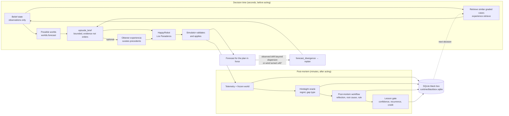
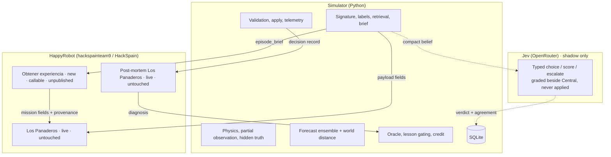
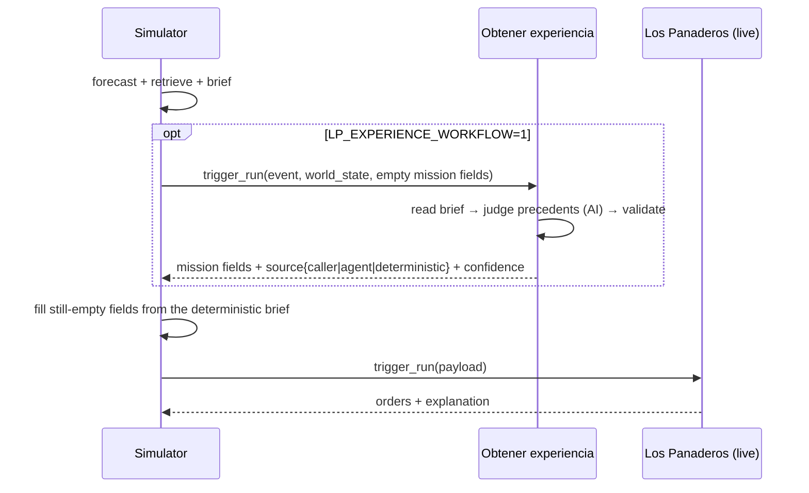
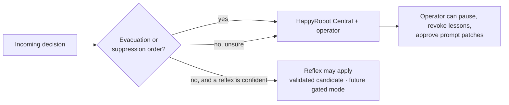

# The self-healing loop in one page

Base: `feature/self-healing-blackbox-oracle-reflection` (black box → oracle → reflection → healing).
This branch adds the forward half (possible worlds, divergence) and decision-time experience
(retrieval, episode brief, optional curator workflow). Nothing existing was removed or republished.

## 1. Two loops, one store



Decision time reads from memory and forecasts; the post-mortem writes to memory. The two never
reason over the same question: the post-mortem asks *why did this decision cost regret*, the
decision asks *what applies now*. Audit: `docs/proposal-audit.md`.

## 2. Who owns what



Why: exact state, reproducibility and measurable distance live where the physics is. Judgement,
communication and explanation live in the agents. Memory is SQLite because one process owns the
loop and every row must be replayable offline; Twin DB is out of scope.

## 3. What the agent receives, and what it is not

```mermaid
flowchart LR
  subgraph brief["world_state.episode_brief (≤1200 chars text)"]
    b1[situation: tick, labels, unwarned]
    b2[priority_districts<br/>people × max(forecast threat, downwind, proximity)]
    b3[downwind_front]
    b4[≤3 cases: did / regret / oracle preferred / root cause]
    b5[≤5 lessons with relevance]
    b6[forecast: dispersion, threatened]
    b7[divergence only if it fired]
  end
  brief --> X{Closing line:<br/>"Cases and lessons are evidence, not orders."}
  X --> Y[Current observations, rules,<br/>constraints prevail]
```

Compatibility fields stay (`similar_cases`, `lessons_learned`, `possible_worlds`,
`forecast_divergence`). `mission`, `priority_districts`, `downwind_front`,
`tactical_constraints` are filled from the brief only when the dispatcher left them empty.
Hidden truth never enters any of these.

## 4. Callable workflow, not a modified one



Inside the workflow: caller fields always win; agent output is used only with confidence ≥ 0.5,
valid district ids and a non-empty mission; otherwise the deterministic brief is returned. Any
failure on the simulator side logs "Experience workflow skipped" and proceeds. Contract:
`docs/happyrobot-experience-contract.md`; client: `simulator/curator.py`.

## 5. Jev reflex: a shadow beside Central

```mermaid
sequenceDiagram
  participant Sim as Simulator
  participant Jev as Jev (typesafe/jev-1.13)
  participant LP as Los Panaderos (live)
  participant PM as Post-mortem
  Sim->>Sim: compact belief state + one typed choice per vehicle<br/>(candidates from oracle.vehicle_options)
  par shadow
    Sim->>Jev: decisions API (3 s timeout)
    Jev-->>Sim: choice / noul(escalate) / score(threat)
    Sim->>Sim: assemble → validate on a copy → route(reflex | central)
  and system 2
    Sim->>LP: trigger_run(payload)
    LP-->>Sim: orders + explanation
  end
  Sim->>Sim: apply LP orders only; save verdict + agreement (reflexes table)
  PM->>PM: oracle grades LP; same seeds grade the shadow → regret, vs_central
```

`simulator/reflex.py`. Off without `OPENROUTER_API_KEY` (read from the gitignored `.env`) or with
`REFLEX_MODE=off`. Route is *central* whenever confidence < 0.7 on the chosen kind of order,
`escalate` ≥ 0.5, any order is high-stakes (`evacuate_*`, `attack_sector`, `contain`), a choice
is unknown, or the assembled decision fails validation. Timeouts and schema errors log "Jev shadow
skipped" and change nothing. A `gated` mode that applies low-stakes reflex orders is deliberately
not implemented: it needs the shadow evidence below first, and explicit approval.

## 6. High stakes stay with people



Lessons enter payloads only above the confidence gate; prompt patches are queued for approval;
nothing is auto-published. The same rule bounds the Jev reflex.

## 7. Measured vs. not yet shown

| Claim | Status | Evidence |
|---|---|---|
| Forecast excludes hidden truth; divergence names what changed | measured | `tests/test_worlds.py`, UI recording |
| Retrieval returns close graded cases with matching labels | measured | `tests/test_experience.py`, `adaptation_eval` retrieval coverage |
| Brief is bounded and keeps the evidence boundary | measured | `tests/test_episode_brief.py` |
| Deterministic brief priorities are at least as good as the warning heuristic on held-out seeds | measured in the simulator | `docs/adaptation-evaluation.md` |
| Replay of oracle plans beats hold, never worse, does not beat warning | measured in the simulator | `docs/learning-evaluation.md` |
| HappyRobot decisions improve because of cases/brief | **not shown** | needs live runs with the payload; browser tests used scripted agents |
| Obtener experiencia improves fleet mission fields | **not shown** | node tests pass; unpublished, no live run yet |
| Jev shadow is typed, validated, fail-closed and never applied | measured | `tests/test_reflex.py`; live smoke: ~250 ms, routed to Central |
| Jev reflex could safely replace Central on low-stakes orders | **not shown** | needs shadow agreement / regret evidence over many decisions (post-mortem `reflex` column, `/api/learning.reflex`) |

In-context learning here means better *retrieved evidence*, not weight updates; the model is
frozen. What improves between incidents is the memory and the gates around it.
